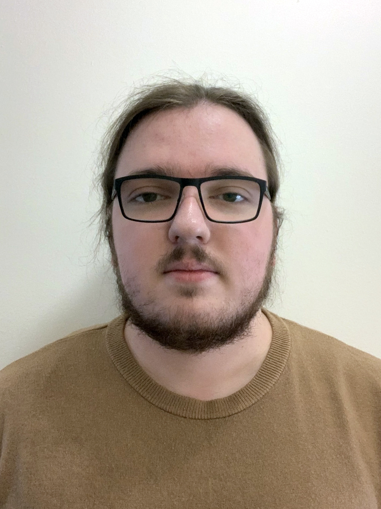

## Hello
{max-width:100px;padding:0px 10px 10px 10px;float:right;margin-top: -40px;}
I am a BA Game Design graduate pursuing MA in Game Design.
\n Interested in low-level and system-level programming. 
\n Firmly believe in fair and open-source software.
\n I have been living in Kent, UK for 10 years now and I love it here.
\---
## Skills 
- ** Programming ** 
\n -- Rust, C++11/14, C, Python, C#. 
\n - ** Have interest in ** 
\n -- Zig, embedded.
\n - ** System adminestration ** 
\n -- Linux, pfsense, hardware.
\n - ** 3D modelling ** 
\n -- Blender and Substance Painter.
\n - ** Game Desig  ** 
\n -- Unreal Engine, Unity, Raylib, Godot.
\n - ** Education  ** 
\n -- Coaching eSport players.
\n -- Educational videos and articles.
\n - ** Misc ** 
\n -- If there is a config, I must tinker.
\n -- Spending 2 hours automating a 5 minute task.
\---
## Study
** Canterbury Christ Church University **
\n - (2022-2023) Games Design MA
\n - (2019-2022) Games Design BA with First-Class Honours

** Canterbury College **
\n - (2015-2017) BTEC Level 3 Diploma in IT with D, M

** Chaucer Technology School **
\n - (2013-2015) GCSEs
\---
## Work
** (2016 - now) Freelance **
\n - Python
\n -- Developed a user-facing interface for students of an educational facility.
\n -- System automation.
\n -- Information processing. 
\n - C++
\n -- Contributing to open-source. 
\n - System adminestration
\n -- Setup hardware and software for linux servers, routers.
\n - Design
\n -- Designed and published [modern version of old fixedsys font](https://github.com/delinx/Fixedsys-Modern).

** (2017 - now) Metafy.gg (Formally Gamersrdy) **
\n - Individual eSports coach focused on CS:GO / FPS

** (2020, 2022-23) Research Internship - Arcade Britannia VR **
\n - 3D modelling and texturing arcade cabinets for use in-game engine.
\n - Project design and managment. 

